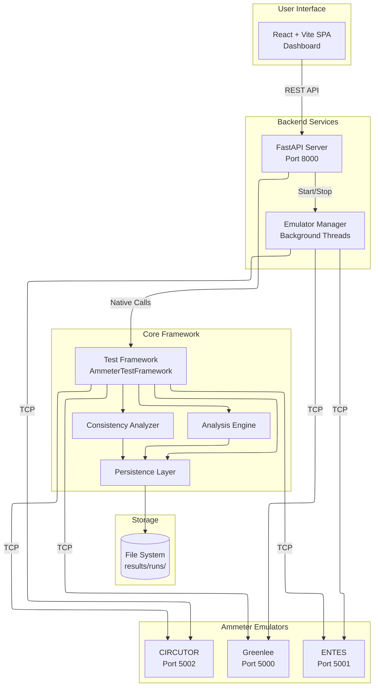
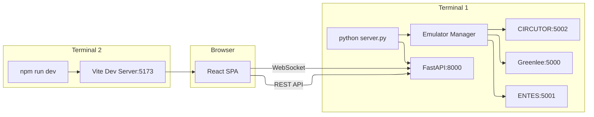
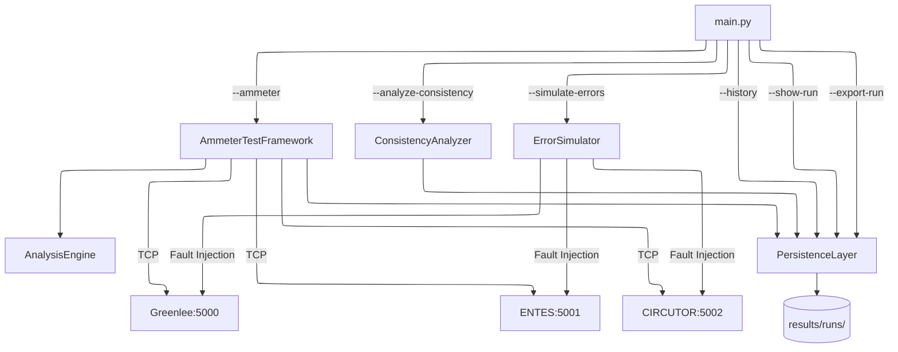
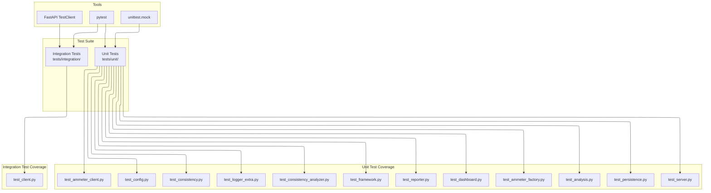

# Ammeter Testing QA Framework

A comprehensive, configuration-driven testing framework designed for automated Quality Assurance of Embedded Current Measurement Systems (Ammeters). 

This project provides a robust API to communicate with Greenlee, ENTES, and CIRCUTOR ammeter emulators, performing precise time-based sampling, statistical data analysis, and historical consistency tracking. The system features a modern React + Vite Single-Page Application (SPA) dashboard powered by a FastAPI backend.

---

## System Architecture



---

## Documentation
For a deep dive into the architectural decisions, structural patterns, and the transition to the modern React/FastAPI stack, please refer to the technical specification in [docs/design.md](docs/design.md).

---

## Key Features

* **Unified API:** A single `AmmeterClient` architecture seamlessly handles different TCP-based hardware.
* **Precision Sampling:** Absolute time scheduling (`time.monotonic()`) eliminates cumulative drift during long duration tests.
* **Configurable Execution:** Control the framework entirely via `config/config.yaml` or dynamically via the web UI (Mode, Duration, Frequency, Tolerances).
* **Modern Client-Server Architecture:** A robust FastAPI Python backend serves a fast, responsive React UI built with Material-UI (MUI) and Chart.js.
* **Historical Analysis:** Tracks hardware performance over time to calculate "Relative Consistency" across devices, determining the most reliable ammeter automatically.
* **Advanced Visual Analytics:** Compare multiple historical runs side-by-side with overlaid time-series charts and aggregate statistical grids.

---

## Getting Started

### 1. Prerequisites
Ensure you have Python 3.10+ and Node.js 18+ installed.

**Install Backend Dependencies:**
```bash
pip install -r requirements.txt
```

**Install Frontend Dependencies:**
```bash
cd frontend
npm install
```

### 2. Configuration
Modify `config/config.yaml` to define your baseline test parameters. The system supports two sampling modes: `count` and `duration`.

## Advanced Features

### 1. Web Dashboard (React & Vite)
The system includes a beautiful SPA Dashboard written in React. It offers:
- Real-time polling of current tests
- History and analytics of past tests
- Sorting, filtering, and side-by-side test comparisons
- Dark/Light mode, with dynamic charts powered by Chart.js
- Download options for raw data (CSV) and analytical graphs (Time Series and Histogram)

Start the dashboard:
```bash
python server.py
# Open a browser at http://localhost:5173 (if using dev server) or http://127.0.0.1:8000
```

### 2. Exporting Data (CSV & Graphs)
To optimize disk usage, the framework generates heavy artifacts **on-demand**. 
From the React Dashboard, you can simply click the download buttons in the Run Details page to instantly generate and download these files. Alternatively, you can use the CLI:
```bash
python main.py --export-run <test_id>
```
The following files are supported:
- **`data.csv`**: Contains all test configurations, expected vs successful sample counts, statistical analysis (Mean, RMS, Variance, etc), and the full list of raw time-series measurements with their success state and errors.
- **`time_series.png`**: A line chart visualization of the collected measurements over time.
- **`histogram.png`**: A frequency distribution of the collected currents.

### 3. Running the System



The framework utilizes a modern decoupled architecture. You will need to start both the backend server and the frontend development server.

**Start the Backend (FastAPI):**
```bash
# In the root directory
python server.py
```
*(This automatically spins up the hardware emulators in the background and starts the API server on `http://127.0.0.1:8000`)*

**Start the Frontend (React/Vite):**
```bash
# In a new terminal, inside the frontend/ directory
npm run dev
```

The application will be available at `http://localhost:5173`.

---

## Viewing Results (Interactive Dashboard)

The React frontend serves as your primary control center and analytics dashboard.

### The Main Dashboard (`/`)
- **Control Panel:** Trigger new tests across all ammeters directly from the UI, overriding duration and frequency on the fly.
- **Accuracy Assessment:** Automatically calculates and highlights the most reliable hardware based on the standard deviation of historical means.
- **Aggregate Statistical Metrics:** A global breakdown of Min, Max, Mean, Median, and Std Dev across all historical runs for each ammeter type.
- **Recent Executions:** A fully sortable data table showing all historical runs. Clicking a row navigates to an in-depth run details page.

### Run Comparison Analysis (`/compare`)
A dedicated view allowing you to select multiple historical runs via a multi-select dropdown and compare them side-by-side using:
- **Mean Current Comparison:** A bar chart comparing the average current of the selected runs.
- **Time-Series Overlay:** A line chart that overlays the actual measurement samples of multiple runs to easily spot drift and noise.

### Dedicated Run Details (`/run/:id`)
A focused page for an individual run, featuring a time-series line chart of the test's signal, a statistical overview bar chart, and a granular breakdown of captured errors.

---

## Command Line Interface (CLI)



While the React dashboard provides a full visual experience, the core framework can also be executed entirely from the terminal using `main.py`. This is ideal for CI/CD pipelines or headless servers.

### Run Tests via CLI
Execute a test against a specific ammeter or all ammeters sequentially:
```bash
python main.py --ammeter greenlee
python main.py --ammeter all
```
*You can override configurations on the fly: `--count 100 --duration 10 --frequency 2.5`*

### Result Management via CLI
List all past test executions, including their unique UUIDs, timestamp, and pass rates:
```bash
python main.py --history
```

View the detailed statistical report for a specific test run:
```bash
python main.py --show-run [TEST_ID]
```

Run the "Relative Consistency" algorithms across the entire archive:
```bash
python main.py --analyze-consistency
```

---

## Testing the Framework



The backend features an exhaustive `pytest` suite simulating edge cases, configuration validation, consistency algorithms, and native FastAPI API endpoint validation.

```bash
# Run all 58 backend tests
$env:PYTHONPATH="." 
pytest tests/
```

