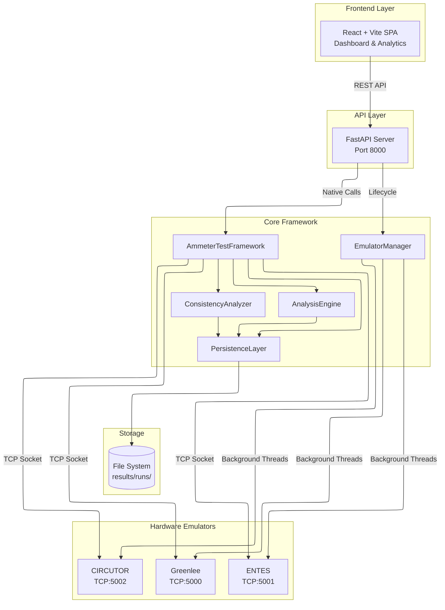
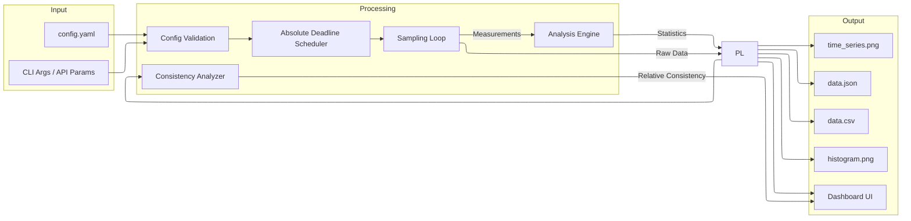
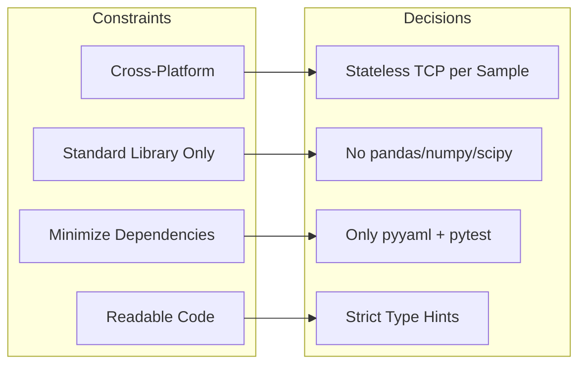

# System Design & Architecture Decisions

This document outlines the core technical and architectural decisions made while designing the Ammeter Testing QA Framework, explicitly addressing the requirements of the **Embedded Systems Quality Assurance** exam.

## System Architecture Overview



## Data Flow Diagram



## Compliance with Exam Specification

### 1. Unified Measurement API
**Requirement:** Work with multiple ammeter types and provide consistent reporting.
**Solution:** We implemented the **Factory Pattern** combined with a **Stateless Client Wrapper**. 
The `AmmeterFactory` instantiates an `AmmeterClient` which handles pure TCP socket logic. The client knows nothing about the internal math of the ammeters—it only knows which byte payload to send and what port to connect to. This guarantees uniform exception handling across all devices (connection timeouts, parsing errors, etc.).

### Phase 7: Persistence & Export
The `PersistenceLayer` serializes the resulting object into a self-contained `data.json` file inside a dynamically generated timestamped directory. 
To optimize disk usage, heavy artifacts are generated **on-demand** (either via CLI flags or Web API routes) rather than automatically for every test. When requested:
1. **CSV Export:** It dynamically parses the `data.json` and writes a `data.csv` file that includes both the statistical summary block and the flat list of all measurements for spreadsheet viewing.
2. **Graph Generation:** It dynamically uses `matplotlib` (running headlessly via the 'Agg' backend) to plot `time_series.png` and `histogram.png` of the current distribution.

These artifacts ensure a durable historical record of every test, facilitating analysis without a persistent relational database. They are served dynamically over HTTP by the FastAPI application for download in the React frontend.

### 2. Measurement Sampling & Timing Precision
**Requirement:** Configurable number of measurements, duration, and sampling frequency with precise timing.
**Solution:** 
- The framework dynamically infers the sampling strategy directly from the presence of `measurements_count` or `total_duration_seconds` in the configuration, eliminating redundant configuration flags.
- **Absolute Deadline Scheduling:** We used an absolute scheduling algorithm using `time.monotonic()`. The `TestFramework` calculates the precise timestamp for every future measurement sample before the loop starts. If a specific TCP request times out, the engine skips the sleep delay and instantly attempts to catch up to the absolute schedule, eliminating cumulative timing drift.
- **Strict Tick Enforcement:** The framework does *not* retry failed measurements within the same tick. A failed connection or timeout is recorded as an error and consumes that tick. This ensures the frequency schedule is rigorously maintained over time.

### 3. Result Analysis & Accuracy Assessment
**Requirement:** Compute statistical metrics, analyze performance consistency, and determine relative accuracy.
**Solution:** 
- The `AnalysisEngine` computes standard metrics (mean, median, std dev, min, max) using the Python standard library (`statistics`), cleanly handling edge cases (0 or 1 samples).
- **Consistency Analyzer (Bonus):** Without a calibrated reference, absolute accuracy cannot be proven. Instead, we dynamically evaluate **Relative Consistency** by traversing the history of all runs via the `ConsistencyAnalyzer`, calculating the "Mean of Means" and "Standard Deviation of Means" for each ammeter type over time. This dynamically identifies which ammeter type produces the most reliable, stable outputs across hundreds of testing sessions.

### 4. Test Status Evaluation Rules
**Requirement:** Deterministic evaluation of pass/fail criteria.
**Solution:** 
Statuses are rigorously evaluated against the `acceptable_error_rate` defined in the configuration (defaulting to 10% allowed failure):
- **PASS:** `successful_samples >= (1 - acceptable_error_rate) * expected_samples`.
- **PARTIAL:** `successful_samples > 0`, but below the PASS threshold.
- **FAIL:** `successful_samples == 0` when `expected_samples > 0`.
- **ERROR:** A fatal framework-level exception prevented normal completion.

### 5. Result Management & Visualization
**Requirement:** Robust result archiving, visualization, and zero-server UI.
**Solution:** 
- **Unified Hierarchy:** All test runs are grouped by timestamp under `results/runs/`. Each contains a raw `data.json` file.
- **Client-Server Architecture (React & FastAPI):** While the original proof-of-concept utilized a static HTML file, the system has evolved into a robust decoupled architecture. A **FastAPI** Python backend exposes REST endpoints (`/api/run`, `/api/runs`, `/api/consistency`) which power a modern **React + Vite** Single-Page Application (SPA) utilizing Material-UI (MUI) and Chart.js.
- **Advanced Visual Analytics:** The React frontend provides complex analytical views, including a globally sortable run history, a dedicated Run Details page with statistical breakdowns, and a `/compare` route that allows users to overlay time-series measurements from multiple hardware runs side-by-side.

### 6. Configuration-Driven Architecture (Bonus)
**Requirement:** Create a configuration-driven testing approach.
**Solution:** 
Eliminated all hardcoded parameters from the codebase. The entire framework is orchestrated strictly by `config/config.yaml`. The factory reads ports/commands, the analysis engine reads requested metrics, and the sampling engine reads timings natively from the configuration file.

---

## Development Methodology

```mermaid
---
config:
  layout: elk
---
flowchart TD
    subgraph "Phase 1: Foundation"
        LCR[Legacy Code Review<br/>& Bug Fixes]
        DMA[Domain Modeling<br/>& Architecture]
    end
    
    subgraph "Phase 2: Core Engines"
        ED[Engine Development]
        QA[Quality Assurance<br/>& Testing]
    end
    
    subgraph "Phase 3: Frontend & API"
        FV[Frontend Visualization<br/>& React Migration]
        NA[Native API Integration<br/>(OOP Backend)]
    end
    
    LCR --> DMA
    DMA --> ED
    ED --> QA
    QA --> FV
    FV --> NA
```

To ensure a robust and production-ready solution, the project was executed in the following structured methodology:

- **1. Legacy Code Review & Bug Fixes:** 
  To meet the strict requirement of using the existing ammeter emulation infrastructure without unnecessary structural changes to their logic, we first had to identify and patch several critical bugs in the provided boilerplate code:
  - **Port Mismatches:** `main.py` initialized emulators on ports 5001, 5002, and 5003, which violated the documented specification. We corrected these to 5000, 5001, and 5002.
  - **Incorrect Client Commands:** The placeholder client calls were missing required instruction flags. We updated them to send the exact required bytes (e.g., `MEASURE_GREENLEE -get_measurement` instead of just `MEASURE_GREENLEE`).
  - **Circutor Extraneous Flag:** The Circutor emulator source code incorrectly demanded an undocumented `-current` flag. We patched the emulator to accept the standard measurement command.
  - **Broken Logger:** `TestLogger` initialized a log directory but never attached a `FileHandler`, resulting in lost logs. We attached the handler to ensure proper file persistence.
  - **Broken Examples & Missing Imports:** We fixed a missing `Dict` import that crashed the original skeleton test framework, and patched broken function calls in the skeleton examples.
  
- **2. Domain Modeling & Architecture:** 
  We completely separated the data layer from the execution layer using strict `dataclasses` defined in `src/testing/types.py`. This enforces a strict schema for all data passing through the system:
  
  - **`MeasurementResult`**: Represents a single sample. Tracks timestamp, value, success flag, and specific error categories.
  - **`TestRunResult`**: Represents an entire testing session. Tracks metadata, configuration, integrity metrics, the full list of samples, calculated statistics, and aggregated errors.

  We then built the Factory and stateless `AmmeterClient` to handle the core TCP logic while passing these strict data objects around.

- **3. Engine Development:** 
  We implemented strict YAML validation (rejecting conflicting configurations) and built the absolute-time sampling engine to guarantee precise timing. Following this, we built the statistical math engine and JSON persistence layer.

- **4. Quality Assurance & Testing:** 
  We developed an exhaustive testing suite (`pytest`) comprising Unit Tests (using mocked sockets for deterministic edge-case testing) and Integration Tests (verifying communication with the live emulators). 
  - Achieved **98% overall test coverage** across over 50 unit tests.
  - Enforced strict PEP8 coding standards with `flake8` and `black` to ensure **0 linting errors**.

- **5. Frontend Visualization & React Migration:** 
  To scale the visual capabilities of the framework, we migrated from a static HTML generator to a modern **React + TypeScript** ecosystem built on Vite. This allowed us to introduce complex state management (e.g., sorting tables, multi-select run comparisons, interactive tooltips) using Material-UI components, drastically improving the user experience over a static report.
  
- **6. Native API Integration (OOP Backend):**
  Initially, the API server utilized `subprocess.run()` to launch CLI commands for each test. We refactored the FastAPI server (`server.py`) to natively instantiate the `AmmeterTestFramework` and `ErrorSimulator` objects in memory. This eliminates the massive overhead of spinning up new Python interpreters for every request, allows for dynamic config manipulation on-the-fly, and adheres strictly to industry standard Object-Oriented server design. Fully verified with FastAPI `TestClient` API unit tests.

---

## Technical Constraints Respected & Design Trade-offs



- **Standard Library over External Analytics:** We explicitly avoided heavy data science libraries like `pandas`, `numpy`, or `scipy`. While this required building custom statistical parsing logic, given the relatively low mathematical complexity required (standard mean/median calculations), dropping these massive dependencies dramatically simplifies installation and cross-platform compatibility. Only `pyyaml` (for config parsing) and `pytest` (for automated testing) were added.
- **Stateless TCP Connections:** We utilized a fresh socket connection per measurement sample. While this adds minor connection overhead, it ensures absolute resilience against stale sockets and connection drops, especially since the rudimentary emulators do not reliably support persistent HTTP-style keep-alive logic.
- **Maintainability:** Enforced strict Python type-hinting across all files for maximum readability, self-documentation, and IDE safety.
