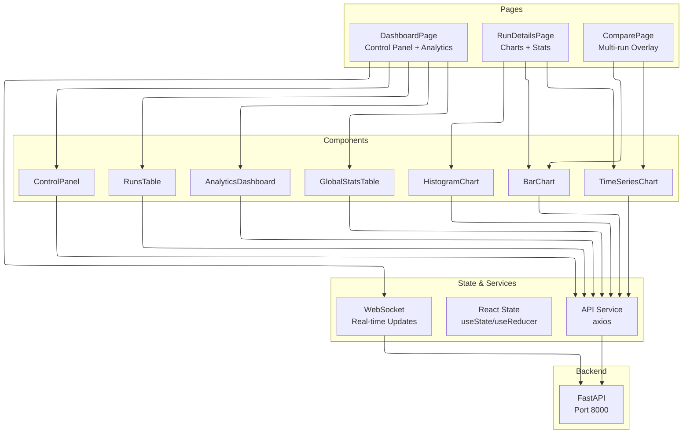

# Ammeter Testing Dashboard - React + TypeScript + Vite

A modern Single-Page Application (SPA) dashboard for the Ammeter Testing QA Framework, built with React 18, TypeScript, Vite, Material-UI (MUI), and Chart.js.

## Frontend Architecture



## Technology Stack

- **Framework:** React 18 with TypeScript
- **Build Tool:** Vite 5
- **UI Library:** Material-UI (MUI) v5
- **Charts:** Chart.js v4 with react-chartjs-2
- **Routing:** React Router v6
- **State Management:** React Hooks (useState, useReducer, useContext)
- **HTTP Client:** Axios
- **Linting:** Oxlint with TypeScript support

## Project Structure

```
frontend/
├── src/
│   ├── components/          # Reusable UI components
│   │   ├── AnalyticsDashboard.tsx
│   │   ├── ControlPanel.tsx
│   │   ├── GlobalStatsTable.tsx
│   │   └── RunsTable.tsx
│   ├── pages/               # Page-level components
│   │   ├── DashboardPage.tsx
│   │   ├── RunDetailsPage.tsx
│   │   └── ComparePage.tsx
│   ├── api.ts               # Axios API client
│   ├── theme.ts             # MUI theme configuration
│   ├── App.tsx              # Root component with routing
│   └── main.tsx             # Entry point
├── public/                  # Static assets
├── package.json
├── tsconfig.json
├── vite.config.ts
└── .oxlintrc.json
```

## Key Features

### Dashboard Page (`/`)
- **Control Panel:** Trigger new tests with configurable parameters
- **Analytics Dashboard:** Real-time accuracy assessment with consistency metrics
- **Global Statistics:** Aggregate metrics across all historical runs
- **Runs Table:** Sortable, filterable history of all test executions

### Run Details Page (`/run/:id`)
- Time-series line chart of measurements
- Statistical overview bar chart
- Error breakdown and granular data table

### Compare Page (`/compare`)
- Multi-select dropdown for historical runs
- Mean current comparison bar chart
- Time-series overlay for side-by-side analysis

## Development

```bash
# Install dependencies
npm install

# Start development server (with HMR)
npm run dev

# Build for production
npm run build

# Preview production build
npm run preview

# Lint code
npm run lint
```

## API Integration

The frontend communicates with the FastAPI backend via REST endpoints:
- `GET /api/runs` - List all test runs
- `GET /api/run/{id}` - Get detailed run data
- `POST /api/run` - Execute new test
- `GET /api/consistency` - Get consistency analysis
- `GET /api/export/{id}` - Download CSV/graphs

Real-time updates during test execution are delivered via WebSocket connection to `/ws`.

## Theming

Custom MUI theme with:
- Light/Dark mode support
- Custom color palette for data visualization
- Responsive breakpoints
- Chart.js color coordination
